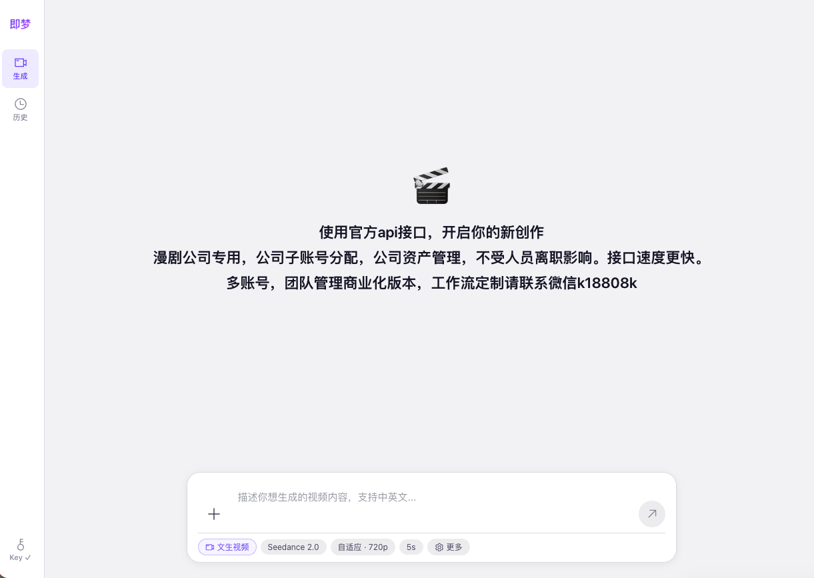
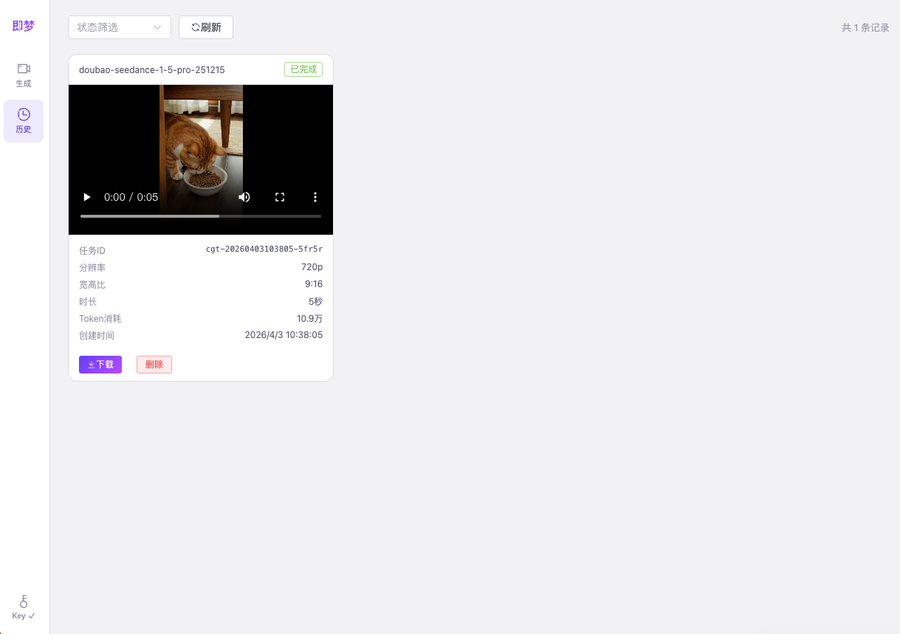

# Jimeng Video - 即梦API接口视频生成工具 页面仿官方
## 在线访问

项目通过 GitHub Actions 自动部署到 GitHub Pages：

👉 [https://yanbaoke.github.io/jimeng-Seedance2-vue-html/](https://yanbaoke.github.io/jimeng-Seedance2-vue-html/)


基于 [即梦 (Jimeng)](https://jimeng.jianying.com) / 火山引擎 Ark API 的视频生成 Web 客户端，UI 仿照即梦官网风格，支持多模型、多模式的 AI 视频生成，提供任务管理与视频下载功能。




## 功能特性

### 视频生成
- **文生视频** — 输入文字描述即可生成视频
- **图生视频（首帧）** — 上传首帧图片，AI 生成后续画面
- **图生视频（首尾帧）** — 上传首帧和尾帧图片，AI 补全中间过渡
- **参考图生视频** — 上传多张参考图，AI 结合文字描述生成视频

### 模型支持
| 模型 | 说明 |
|------|------|
| Seedance 2.0 Fast | 高性价比，快速生成高质量视频 |
| Seedance 2.0 限免版 | 旗舰模型，画质与动作表现优异 |
| Seedance 1.5 Pro | 均衡之选，兼顾质量与速度 |
| Seedance 1.0 / 1.0 Fast | 稳定可靠的经典模型 |
| Seedance 1.0 Lite (文生/图生) | 轻量模型，适合快速预览 |

### 参数配置
- 画面比例：自适应 / 16:9 / 9:16 / 4:3 / 3:4 / 1:1 / 21:9
- 清晰度：480p / 720p / 1080p（视模型而定）
- 时长：2s ~ 15s（视模型而定）
- 高级选项：Seed 种子、生成音频、固定镜头、水印

### 任务管理
- 任务列表筛选（按状态：排队中 / 生成中 / 已完成 / 失败 / 超时 / 取消）
- 实时轮询任务状态，自动更新
- 视频在线预览与一键下载
- Token 消耗统计显示
- 任务取消与删除

## 技术栈

- **Vue 3** — Composition API + `<script setup>`
- **Vite 6** — 开发与构建
- **Element Plus** — UI 组件库
- **Axios** — HTTP 请求


## 快速开始

### 环境要求

- Node.js >= 18
- 即梦 / 火山引擎 Ark API Key

### 安装运行

```bash
# 克隆项目
git clone https://github.com/your-username/jimeng-video.git
cd jimeng-video

# 安装依赖
npm install

# 启动开发服务器
npm run dev
```

启动后访问 `http://localhost:3000`，在页面右上角填入 API Key 即可使用。

### 构建部署

```bash
# 构建生产版本
npm run build

# 预览构建结果
npm run preview
```

构建产物在 `dist/` 目录，可部署到任意静态服务器。项目直接请求火山引擎 Ark API，无需额外配置后端代理。

## 项目结构

```
src/
├── App.vue                  # 主布局（侧边栏 + 内容区）
├── main.js                  # 入口文件
├── api/
│   └── index.js             # API 请求封装（创建任务、查询、删除、上传）
├── components/
│   ├── Sidebar.vue          # 侧边栏导航 & API Key 设置
│   ├── GenerationForm.vue   # 视频生成表单（仿官方 UI 风格）
│   └── TaskHistory.vue      # 任务历史列表（卡片式布局）
└── styles/
    └── global.css           # 全局样式 & CSS 变量
```

## API 说明

本项目直接请求火山引擎 Ark API（`https://ark.cn-beijing.volces.com/api/v3`），无需后端代理，开发与生产环境均可直接使用。

| 功能 | 方法 | 路径 |
|------|------|------|
| 创建生成任务 | POST | `/contents/generations/tasks` |
| 查询单个任务 | GET | `/contents/generations/tasks/:id` |
| 批量查询任务 | GET | `/contents/generations/tasks` |
| 取消/删除任务 | DELETE | `/contents/generations/tasks/:id` |
| 上传文件 | POST | `/files` |

API Key 存储在浏览器 `localStorage` 中，仅在本地使用，不会上传至第三方服务。

## 商业版 & 定制服务

为漫剧公司定制专用版本，面向企业用户提供以下核心优势：

- **公司子账号分配** — 管理员统一分配子账号，员工使用独立账号操作
- **公司资产管理** — 生成的视频、任务记录等资产归属公司，不受人员离职影响
- **接口速度更快** — 相比官方页面，API 直连响应更迅速，生成效率更高
- **多账号团队管理** — 支持团队协作，批量管理成员与配额
- **工作流定制** — 可根据业务需求定制自动化视频生成工作流

> 商业化版本、多账号团队管理、工作流定制请扫描微信二维码联系：
>
> 

## License

MIT

---

# Jimeng Video - AI Video Generation Tool | Official-Style UI

## Online Access

The project is automatically deployed to GitHub Pages via GitHub Actions:

👉 [https://yanbaoke.github.io/jimeng-Seedance2-vue-html/](https://yanbaoke.github.io/jimeng-Seedance2-vue-html/)

A web client for AI video generation based on [Jimeng](https://jimeng.jianying.com) / Volcengine Ark API, featuring an official-style UI. Supports multiple models and modes for AI video generation, with task management and video download capabilities.


## Features

### Video Generation
- **Text-to-Video** — Generate videos from text descriptions
- **Image-to-Video (First Frame)** — Upload a first frame image, AI generates subsequent frames
- **Image-to-Video (First & Last Frame)** — Upload first and last frame images, AI interpolates the transition
- **Reference Image-to-Video** — Upload multiple reference images, AI combines them with text descriptions to generate videos

### Model Support
| Model | Description |
|-------|-------------|
| Seedance 2.0 Fast | Cost-effective, fast generation of high-quality videos |
| Seedance 2.0 Free Trial | Flagship model with excellent image quality and motion |
| Seedance 1.5 Pro | Balanced choice, quality meets speed |
| Seedance 1.0 / 1.0 Fast | Stable and reliable classic models |
| Seedance 1.0 Lite (Text/Image-to-Video) | Lightweight model for quick previews |

### Parameter Configuration
- Aspect Ratio: Auto / 16:9 / 9:16 / 4:3 / 3:4 / 1:1 / 21:9
- Resolution: 480p / 720p / 1080p (model-dependent)
- Duration: 2s ~ 15s (model-dependent)
- Advanced Options: Seed, Generate Audio, Fixed Camera, Watermark

### Task Management
- Task list filtering (by status: Queued / Generating / Completed / Failed / Timeout / Cancelled)
- Real-time task status polling with auto-updates
- Video online preview and one-click download
- Token consumption statistics display
- Task cancellation and deletion

## Tech Stack

- **Vue 3** — Composition API + `<script setup>`
- **Vite 6** — Development & Build
- **Element Plus** — UI Component Library
- **Axios** — HTTP Requests

## Quick Start

### Requirements

- Node.js >= 18
- Jimeng / Volcengine Ark API Key

### Installation & Running

```bash
# Clone the project
git clone https://github.com/your-username/jimeng-video.git
cd jimeng-video

# Install dependencies
npm install

# Start development server
npm run dev
```

After starting, visit `http://localhost:3000` and enter your API Key in the top-right corner to start using.

### Build & Deploy

```bash
# Build for production
npm run build

# Preview build result
npm run preview
```

Build artifacts are in the `dist/` directory and can be deployed to any static server. The project directly requests Volcengine Ark API without requiring a backend proxy.

## Project Structure

```
src/
├── App.vue                  # Main layout (Sidebar + Content area)
├── main.js                  # Entry file
├── api/
│   └── index.js             # API request wrapper (create, query, delete, upload)
├── components/
│   ├── Sidebar.vue          # Sidebar navigation & API Key settings
│   ├── GenerationForm.vue   # Video generation form (official UI style)
│   └── TaskHistory.vue      # Task history list (card layout)
└── styles/
    └── global.css           # Global styles & CSS variables
```

## API Reference

This project directly requests the Volcengine Ark API (`https://ark.cn-beijing.volces.com/api/v3`) without a backend proxy, suitable for both development and production environments.

| Feature | Method | Path |
|---------|--------|------|
| Create generation task | POST | `/contents/generations/tasks` |
| Query single task | GET | `/contents/generations/tasks/:id` |
| Batch query tasks | GET | `/contents/generations/tasks` |
| Cancel/Delete task | DELETE | `/contents/generations/tasks/:id` |
| Upload file | POST | `/files` |

The API Key is stored in the browser's `localStorage` and used locally only, never uploaded to third-party services.

## Commercial Version & Custom Services

Custom versions for comic drama companies, offering the following core advantages for enterprise users:

- **Company Sub-account Management** — Administrators assign sub-accounts, employees use independent accounts
- **Company Asset Management** — Generated videos, task records belong to the company, unaffected by employee turnover
- **Faster API Response** — Direct API connection is faster than the official page, higher generation efficiency
- **Multi-account Team Management** — Support team collaboration, batch member and quota management
- **Workflow Customization** — Custom automated video generation workflows based on business needs

> For commercial versions, multi-account team management, and workflow customization, scan the WeChat QR code:
>
> 

## License

MIT
